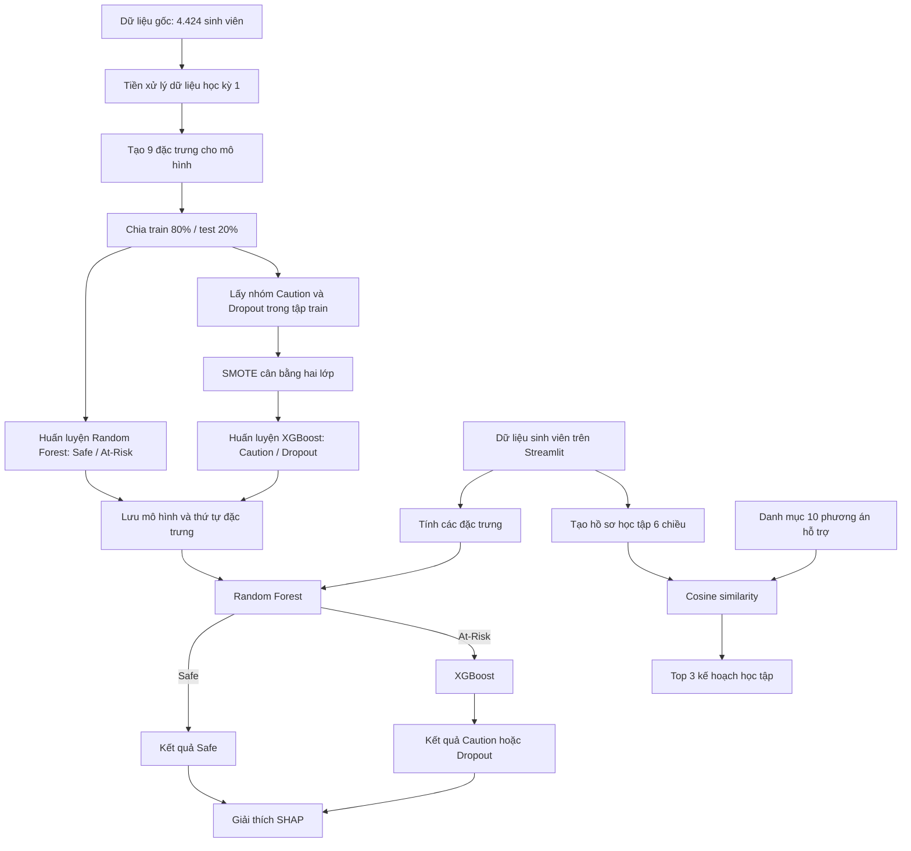

Dự án **StudentDSS** là một hệ thống hỗ trợ quyết định trong học tập. Từ kết quả học kỳ 1, hệ thống trả lời ba câu hỏi:

1. **Sinh viên thuộc nhóm nào?** An toàn, cần theo dõi hay có nguy cơ bỏ học.
2. **Những đặc trưng nào ảnh hưởng đến dự đoán?** Giải thích bằng SHAP.
3. **Nên đề xuất hỗ trợ gì?** Chọn các kế hoạch học tập phù hợp bằng Content-Based Filtering.

Để hiểu đúng dự án, cần phân biệt **quá trình huấn luyện mô hình** và **quá trình ứng dụng sử dụng mô hình đã huấn luyện**.

**1. Pipeline tổng thể**



Điểm quan trọng: **nhánh khuyến nghị hiện lấy trực tiếp dữ liệu học tập**. Kết quả dự đoán và giá trị SHAP chưa được đưa vào thuật toán chọn kế hoạch.

---

**2. Dữ liệu đầu vào và cách tạo đặc trưng**

Tệp dữ liệu gốc có **4.424 dòng, 35 cột**, bao gồm thông tin cá nhân, tài chính và kết quả hai học kỳ. Dự án chỉ sử dụng các chỉ số của **học kỳ 1** để dự đoán.

Trong [data_preprocessing.ipynb](D:/project/StudentDSS/data_preprocessing.ipynb), các cột được đổi tên và rút gọn:

| Đặc trưng                     | Ý nghĩa trong hệ thống                                |
| ----------------------------- | ----------------------------------------------------- |
| `1st_sem_enrolled`            | Số học phần đăng ký                                   |
| `1st_sem_evaluations`         | Số lượt đánh giá                                      |
| `1st_sem_without_evaluations` | Số học phần không có đánh giá                         |
| `1st_sem_approved`            | Số học phần đạt                                       |
| `1st_sem_failed`              | Chỉ số không đạt, được tính từ evaluations − approved |
| `1st_sem_grade`               | Điểm trung bình học kỳ 1, thang 20                    |
| `1st_sem_pass_rate`           | approved / evaluations                                |

Khi huấn luyện và dự đoán, hệ thống thêm hai đặc trưng:

$$
\text{failed\_burden} = \frac{\text{failed}}{\text{enrolled}}
$$

$$
\text{ghosting\_rate} = \frac{\text{without\_evaluations}}{\text{enrolled}}
$$

Như vậy, mô hình phân loại nhận **9 đặc trưng**. Các phép chia có mẫu số bằng 0 được xử lý để tránh lỗi.

Ví dụ, một sinh viên có:

- Đăng ký 6 học phần.
- Có 6 lượt đánh giá.
- Đạt 2, không đạt 4.
- Không có học phần bỏ đánh giá.
- Điểm trung bình 9,5/20.

Các tỷ lệ tương ứng là:

$$
\text{pass\_rate} = \frac{2}{6} \approx 0{,}333
$$

$$
\text{failed\_burden} = \frac{4}{6} \approx 0{,}667
$$

$$
\text{ghosting\_rate} = \frac{0}{6} = 0
$$

Những tỷ lệ này giúp mô hình so sánh các sinh viên có khối lượng đăng ký khác nhau.

**Một điểm cần hiểu về tên cột:** dữ liệu có những dòng `evaluations > enrolled`. Vì vậy, `evaluations` không nên mặc nhiên được hiểu là số môn khác nhau đã thi. Tương tự, `evaluations − approved` là chỉ số được dự án xây dựng; cách gọi “số môn rớt” trên giao diện có thể đơn giản hóa ý nghĩa thực tế của dữ liệu.

---

**3. Nhãn mà mô hình đang học là gì?**

Dự án ánh xạ nhãn gốc như sau:

| Nhãn gốc | Nhãn trong dự án | Số lượng |
| -------- | ---------------- | -------: |
| Graduate | Safe             |    2.209 |
| Enrolled | Caution          |      794 |
| Dropout  | Dropout          |    1.421 |

Mô hình học mối liên hệ giữa **kết quả học kỳ 1** và **trạng thái này**.

Cần lưu ý rằng `Enrolled` nghĩa là đang theo học, nhưng được dự án đổi thành `Caution`. Do đó, “cần cảnh báo” là cách diễn giải của hệ thống đối với nhãn gốc; dữ liệu không trực tiếp xác nhận rằng mọi sinh viên đang theo học đều có vấn đề.

Tương tự, `Safe` là tên mới của nhóm đã tốt nghiệp trong dữ liệu huấn luyện. Với sinh viên mới, đây vẫn là **dự đoán**, không phải bảo đảm kết quả tương lai.

---

**4. Vì sao dùng mô hình hai tầng?**

Trong [train_model.ipynb](D:/project/StudentDSS/train_model.ipynb), bài toán ba lớp được chia thành hai quyết định:

```text
Tầng 1: Sinh viên có thuộc nhóm Safe không?
        ├── Có → Safe
        └── Không → At-Risk

Tầng 2: Sinh viên At-Risk thuộc Caution hay Dropout?
```

Cách thiết kế này cho phép mỗi mô hình tập trung vào một bài toán nhị phân.

Đổi lại, **sai sót tầng một sẽ ảnh hưởng trực tiếp đến toàn bộ hệ thống**. Nếu một sinh viên có nguy cơ bỏ học bị tầng một xếp vào Safe, tầng hai sẽ không được xem xét trường hợp đó.

**Tầng một — Random Forest**

Random Forest kết hợp nhiều cây quyết định. Mỗi cây học các quy tắc phân chia dữ liệu, chẳng hạn theo điểm, tỷ lệ đạt hoặc kết quả học phần.

Các cây được huấn luyện với sự ngẫu nhiên trong mẫu dữ liệu và lựa chọn đặc trưng. Khi dự đoán, mô hình tổng hợp xác suất từ các cây để chọn lớp.

Cấu hình của dự án:

| Tham số        |  Giá trị | Vai trò                                    |
| -------------- | -------: | ------------------------------------------ |
| `n_estimators` |      300 | Số cây                                     |
| `max_depth`    |       10 | Giới hạn độ sâu mỗi cây                    |
| `class_weight` | balanced | Điều chỉnh trọng số theo số lượng từng lớp |
| `random_state` |       42 | Giúp tái lập kết quả                       |

Nhãn ở tầng này được tạo bằng cách gộp:

$$
\text{At-Risk} = \text{Caution} \cup \text{Dropout}
$$

Random Forest phù hợp với dữ liệu dạng bảng, có thể học các quan hệ phi tuyến và tương tác giữa các chỉ số mà không cần chuẩn hóa thang đo đầu vào.

**Tầng hai — SMOTE kết hợp XGBoost**

Tập huấn luyện tầng hai chỉ lấy những sinh viên có **nhãn thật** là Caution hoặc Dropout.

Hai nhãn được mã hóa:

```text
Caution → 0
Dropout → 1
```

Do số mẫu Caution ít hơn Dropout, dự án dùng **SMOTE** để tạo thêm mẫu tổng hợp cho lớp ít hơn.

Ý tưởng của SMOTE là chọn một mẫu và một láng giềng cùng lớp, rồi tạo điểm mới giữa chúng:

$$
x_{\text{new}} = x_i + \lambda (x_{\text{neighbor}} - x_i), \quad 0 \leq \lambda \leq 1
$$

SMOTE chỉ áp dụng trên dữ liệu huấn luyện tầng hai; tập kiểm tra được giữ nguyên. Đây là cách tách dữ liệu đúng để tránh đưa mẫu tổng hợp vào quá trình đánh giá.

Tuy nhiên, nội suy có thể tạo ra số học phần dạng thập phân hoặc các tổ hợp đặc trưng không hoàn toàn khớp công thức nghiệp vụ. Đây là một giới hạn cần cân nhắc của việc dùng SMOTE trên bộ đặc trưng này.

Sau đó, **XGBoost** học từ dữ liệu đã cân bằng. Khác với các cây của Random Forest, các cây trong boosting được thêm lần lượt để cải thiện sai số còn lại của mô hình.

Cấu hình chính:

| Tham số                     |  Giá trị |
| --------------------------- | -------: |
| Số cây                      |      200 |
| Độ sâu tối đa               |        4 |
| Learning rate               |     0,05 |
| Hàm đánh giá khi huấn luyện | Log loss |

Khi suy luận, quy tắc quyết định là:

$$
P(\text{Caution}) \ge 0{,}45 \implies \text{Caution}
$$

Nếu không đạt ngưỡng này, kết quả là Dropout.

Ngưỡng **0,45** làm hệ thống dễ chọn Caution hơn so với ngưỡng 0,5. Trong mã hiện tại, ngưỡng được đặt cố định; chưa có bước tìm ngưỡng tối ưu bằng một tập validation riêng.

---

**5. SHAP giải thích dự đoán như thế nào?**

Trong [app.py](D:/project/StudentDSS/app.py), dự án dùng `shap.TreeExplainer` để phân tích mô hình cây.

Ý tưởng của SHAP là phân bổ sự chênh lệch giữa đầu ra của mô hình cho một sinh viên và giá trị nền thành đóng góp của từng đặc trưng:

$$
f(x) = \text{giá trị nền} + \sum_i \phi_i
$$

Ở đây, \(\phi_i\) thể hiện đóng góp của đặc trưng thứ \(i\) trên thang đầu ra mà explainer sử dụng.

Ví dụ, mô hình có thể dựa nhiều vào:

- Tỷ lệ đạt thấp.
- Điểm học kỳ thấp.
- Gánh nặng không đạt cao.

Ứng dụng hiện chọn mô hình để giải thích như sau:

| Kết quả              | Mô hình được giải thích |
| -------------------- | ----------------------- |
| Safe                 | Random Forest           |
| Caution hoặc Dropout | XGBoost                 |

Vì vậy, với sinh viên At-Risk, biểu đồ giải thích **quyết định tầng hai**, chưa giải thích đầy đủ cả bước Random Forest đã đưa sinh viên vào nhóm rủi ro.

Ngoài ra, biểu đồ `summary_plot(..., plot_type="bar")` chủ yếu thể hiện **độ lớn đóng góp**, không thể hiện rõ đặc trưng đang đẩy dự đoán về lớp nào như biểu đồ waterfall cho một cá nhân.

SHAP giải thích cách mô hình sử dụng dữ liệu. Nó không chứng minh một đặc trưng là nguyên nhân thực tế khiến sinh viên bỏ học.

---

**6. Thuật toán khuyến nghị kế hoạch học tập**

Phần này nằm trong [recommendation/cbf.py](D:/project/StudentDSS/recommendation/cbf.py), sử dụng **Content-Based Filtering — lọc dựa trên nội dung**.

Ở đây:

- “Nội dung sinh viên” là hồ sơ học tập gồm sáu chiều.
- “Nội dung phương án” là các trọng số trên cùng sáu chiều.
- Hai vector càng giống nhau thì phương án càng được xếp cao.

Hồ sơ sinh viên được tính như sau:

| Chiều              | Công thức                        | Diễn giải                               |
| ------------------ | -------------------------------- | --------------------------------------- |
| `low_grade`        | \(1-grade/20\)                   | Mức điểm thấp                           |
| `low_pass_rate`    | \(1-pass_rate\)                  | Mức tỷ lệ đạt thấp                      |
| `failed_burden`    | \(failed/enrolled\)              | Gánh nặng không đạt                     |
| `evaluation_issue` | \(without_evaluations/enrolled\) | Vấn đề thiếu đánh giá                   |
| `workload_gap`     | \(1-approved/enrolled\)          | Khoảng cách giữa đăng ký và kết quả đạt |
| `high_performance` | \((grade/20)\times pass_rate\)   | Thành tích học tập tốt                  |

Các giá trị được giới hạn trong khoảng **[0,1]**.

Với sinh viên ví dụ ở trên, hồ sơ xấp xỉ:

```text
[0,525; 0,667; 0,667; 0; 0,667; 0,158]
```

Danh mục có **10 phương án**, chẳng hạn học kèm, học lại, điều chỉnh khối lượng, tư vấn cố vấn và hoạt động học thuật nâng cao. Mỗi phương án có một vector trọng số được khai báo sẵn trong CSV.

Ví dụ, phương án **học lại học phần chưa đạt** có trọng số cao ở `failed_burden` và `low_pass_rate`.

Độ phù hợp được tính bằng cosine similarity:

$$
\text{similarity}(s, i) = \frac{s \cdot i}{\left\|s\right\| \left\|i\right\|}
$$

Cosine so sánh hướng của hai vector. Nếu các chiều nổi bật trong hồ sơ sinh viên cũng là các chiều mà phương án tập trung xử lý, điểm tương đồng sẽ cao.

Hệ thống sắp xếp điểm giảm dần và lấy **top 3**. Với hồ sơ ví dụ, kết quả trong notebook là:

1. Học lại học phần chưa đạt — khoảng **0,981**.
2. Điều chỉnh khối lượng học tập — khoảng **0,976**.
3. Tham gia nhóm học tập — khoảng **0,951**.

**Điểm 0,981 là độ tương đồng, không phải xác suất 98,1% rằng phương án sẽ thành công.**

Các “yếu tố kích hoạt” được lấy từ những chiều đóng góp nhiều nhất vào cosine similarity. Tuy nhiên, mã hiện lấy luôn ba chiều cao nhất, nên đôi khi có thể đưa cả chiều đóng góp bằng 0 vào phần giải thích.

Thuật toán này chưa học từ phản hồi sinh viên hay hiệu quả can thiệp thực tế. Chất lượng đề xuất phụ thuộc nhiều vào công thức hồ sơ và trọng số của danh mục.

---

**7. Kết quả kiểm chứng nói lên điều gì?**

Tôi đã chạy lại mô hình lưu sẵn trên tập kiểm tra **885 sinh viên**, được tái tạo bằng cùng cách chia dữ liệu trong notebook:

| Lớp     | Precision | Recall |     F1 |
| ------- | --------: | -----: | -----: |
| Safe    |    76,84% | 80,32% | 78,54% |
| Caution |    33,84% | 42,14% | 37,54% |
| Dropout |    71,56% | 56,69% | 63,26% |

Accuracy tổng thể là **65,88%**.

Có thể đọc các chỉ số như sau:

- **Precision:** trong những người được dự đoán thuộc một lớp, bao nhiêu người đúng?
- **Recall:** trong những người thực sự thuộc lớp đó, hệ thống tìm được bao nhiêu?
- **F1:** chỉ số cân bằng giữa precision và recall.

Chẳng hạn, trong **284 sinh viên Dropout thực tế**, hệ thống phát hiện đúng **161**, tương ứng recall 56,69%. Có **52** người bị xếp Safe và **71** người bị xếp Caution.

Kết quả cho thấy hệ thống phân biệt nhóm Safe tốt hơn, còn nhóm Caution khó nhận diện. Các nhãn đang là công cụ hỗ trợ xem xét hồ sơ, với mức sai số đáng kể.

---

**8. Những chi tiết triển khai cần nhớ**

Ứng dụng hiện là một nguyên mẫu gọn: Streamlit quản lý giao diện và dữ liệu trong session, mô hình được nạp từ `.pkl`, khuyến nghị được đọc từ CSV. Chưa có cơ sở dữ liệu hay cơ chế lưu lịch sử can thiệp.

Một số điểm ảnh hưởng trực tiếp đến cách hiểu kết quả:

- **Tỷ lệ Safe 100% trên giao diện là giá trị gán trong code.** Nó không phải xác suất mà Random Forest trả về. Tỷ lệ Caution/Dropout là xác suất riêng của tầng hai, chưa phải bộ xác suất ba lớp của toàn pipeline.
- **`scaler.pkl` không được dùng khi chạy ứng dụng.** CBF hiện chuẩn hóa bằng công thức và giới hạn [0,1], khác với phần tạo scaler trong notebook huấn luyện.
- **Cờ độ tin cậy thấp của khuyến nghị chưa hoạt động trong luồng hiện tại**, vì hàm gọi không truyền ngưỡng.
- **Dữ liệu CSV đầu vào chưa được kiểm tra đầy đủ**, nên dữ liệu sai cấu trúc hoặc không hợp lệ có thể gây lỗi hay kết quả khó diễn giải.
- **SHAP và CBF phục vụ hai mục đích khác nhau:** SHAP giải thích dự đoán của mô hình; CBF chọn kế hoạch theo mức tương đồng của hồ sơ.

Khi tiếp tục phát triển dự án, ba điểm cần ưu tiên là **làm rõ ý nghĩa đặc trưng và nhãn**, **đánh giá khả năng phát hiện sinh viên rủi ro**, và **kiểm chứng hiệu quả thực tế của các khuyến nghị**. Đây là những yếu tố quyết định hệ thống có hỗ trợ tốt cho cố vấn học tập hay không.
